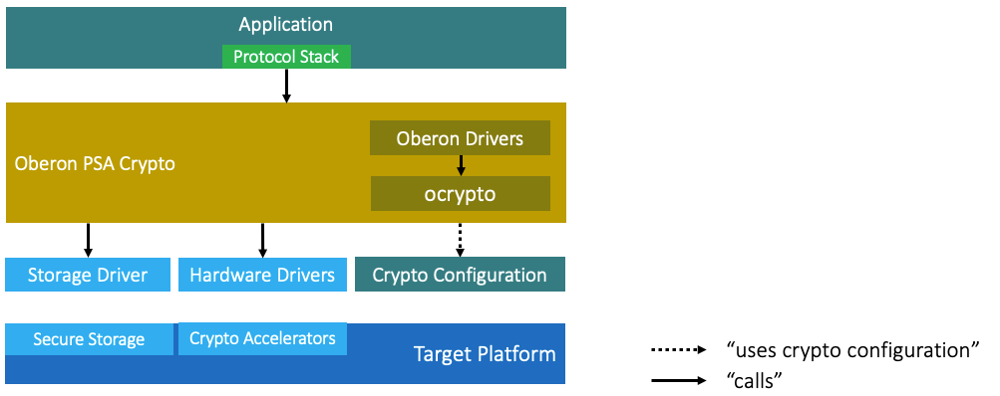
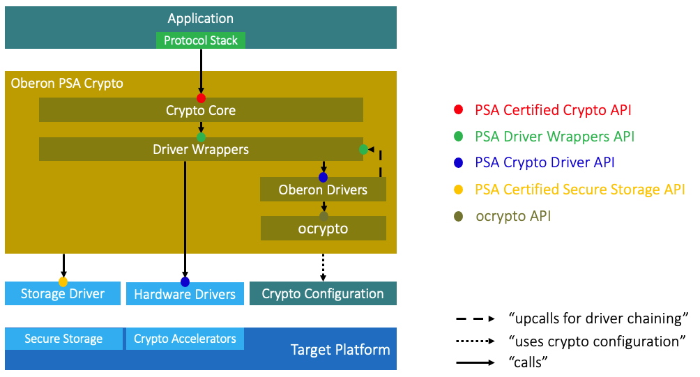

# Architecture

_Oberon PSA Crypto_ implements a refinement of the _PSA Crypto_ architecture,
which Arm has created initially and has become a de-facto industry standard. This
document first introduces the fundamental architecture of _PSA Crypto_, followed
by a description of the variant of this architecture as implemented by _Oberon
PSA Crypto_.

## PSA Crypto Architecture

To advance the state of security for embedded systems, Arm has created a
comprehensive _Platform Security Architecture_ (_PSA_). _PSA Crypto_ is the part
of _PSA_ that covers the cryptographic needs of embedded software. _Figure 1_
gives an overview of _PSA Crypto_:

_Figure 1 - Architecture of PSA Crypto_

An application calls a _PSA Crypto_ implementation through the _PSA Certified
Crypto API_. Thanks to the standardization of this API, an application can easily
switch between different _PSA Crypto_ implementations that have different quality
attributes.

For information on how to write application code that calls the _PSA Certified
Crypto API_, please consult the documentation of the _PSA Certified_
organization.

*Note: A protocol stack that uses cryptographic functions is considered part of
the application and is not discussed separately. _Mbed TLS_ is an example of a
(TLS) protocol stack that can use the _PSA Certified Crypto API_. Currently,
_Mbed TLS_ also contains an _implementation_ of _PSA Crypto_.*

A _PSA Crypto_ implementation may also support the _PSA Crypto Driver API_.
Through this API, a _PSA Crypto_ implementation can delegate actual cryptographic
processing to suitable _crypto drivers_. Such a driver can take advantage of a
chip's hardware crypto accelerator where available.

For building an application and enabling dead code elimination (no unnecessary
drivers and no unnecessary code within the _PSA Crypto_ implementation), a
_crypto configuration_ must be provided for every application. On the one hand,
it defines the set of crypto algorithms called by the application. On the other
hand, it defines the set of _crypto drivers_ to be used for the given _target
platform_.

For information on how to write drivers that _implement_ the _PSA Crypto Driver
API_, please consult the official _PSA Crypto_ documentation.

A storage module needs to be provided by a _target platform's_ _platform
integrator_. It should provide protected storage in particular for secret keys.
If the storage module implements the _PSA Secure Storage API_, it can be directly
used with _Oberon PSA Crypto_.

*Note: The _PSA Certified Crypto API_ "at the top" of a _PSA Crypto_
implementation is the relevant API for _application developers_. The _PSA Crypto
Driver API_ "at the bottom" is relevant for _crypto driver developers_, and for
_platform integrators_ who adapt _crypto drivers_ to their specific _target
platforms_.*

## Oberon PSA Crypto Architecture

Today, inexpensive microcontrollers usually do not provide comprehensive hardware
crypto accelerators for modern crypto algorithms. Often, they only support AES,
and only a limited number of AES modes. Therefore, no _hardware drivers_ can be
provided, and many applications will need a software fallback.

_Oberon PSA Crypto_ provides _Oberon drivers_ as a software fallback that is
footprint- and speed-optimized for inexpensive 32-bit microcontrollers. _Oberon
drivers_ are _crypto drivers_ that provide cryptographic functionality purely in
software, based on _Oberon microsystems'_ lightweight _ocrypto_ library. They are
genuine _crypto drivers_, as they implement the standard _PSA Crypto Driver API_.

_Figure 2_ is an illustration of the _Oberon PSA Crypto_ architecture:

_Figure 2 - Architecture of Oberon PSA Crypto_

For the hardware crypto accelerators of their _target platform_, _platform
integrators_ provide the _hardware drivers_. They are not specific to _Oberon PSA
Crypto_ or its configuration mechanism, so they can be used with any _PSA Crypto_
implementation that supports the _PSA Crypto Driver API_. The _Oberon drivers_
then fill the gaps in crypto functionality that the _target platforms_ do not
support through dedicated hardware.

## Taking a Closer Look

Within _Oberon PSA Crypto_, there are two major modules in addition to the
_Oberon drivers_ that have already been discussed above: the _crypto core_ and
the _driver wrappers_.

The _crypto core_ provides the _PSA Certified Crypto API_ to applications. It
performs parameter validation, handles key management, and forwards calls to the
_driver wrappers_.

The _driver wrappers_ determine what actual _crypto driver_ is called for a given
type of cryptographic operation. For example, guided by the _crypto
configuration_, they may either select a _hardware driver_ for an RSA signature
check in hardware, or an _Oberon driver_ for an ECDSA signature check in
software.

The _driver wrappers_ provide an internal API whose client is the _crypto core_.
They depend on _crypto drivers_ that adhere to the _PSA Crypto Driver API_.

_Figure 3_ is a more detailed illustration of the _Oberon PSA Crypto_
architecture:

_Figure 3 - Detailed Architecture of Oberon PSA Crypto_

In _Figure 3_, the locations of the various APIs are illustrated. The upcalls of
some _Oberon drivers_ into the _driver wrappers_ will later be discussed.

Read more about how to configure _Oberon PSA Crypto_ for an application and
_target platform_, in [Crypto Configuration](Crypto_Configuration.md).
