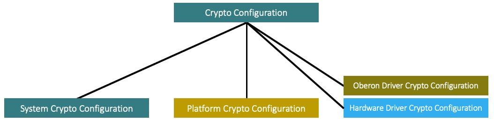

# Crypto Configuration

The _Oberon PSA Crypto_ software library provides a lightweight mechanism for
configuring it, in order to achieve the smallest footprint and highest
performance for a given application on a given _target platform_. This mechanism
is an extension of the standard _PSA Crypto_ configuration mechanism and gives
finer-grained control over which crypto algorithms, for what key types and key
sizes, will be included in the firmware image of an application. In particular,
the following eliminations of unneeded code are done:

- _Crypto drivers_ that are not needed by an application are not built into the
firmware image.

- Within _Oberon drivers_, only the needed parts are built into the firmware
image. For example, only the SHA512 part of an _Oberon driver_ for hash functions
may actually be needed in an application, so the SHA256 etc. code would not be
included in the firmware image. Or if both SHA512 and SHA256 are used in an
application, and a _hardware driver_ is available for SHA256 for the _target
platform_, then the _Oberon driver's_ software implementation of SHA256 will not
be included in the firmware image, only the code for SHA512.

- Unnecessary code within the _driver wrappers_ is filtered out.

This configuration mechanism is lightweight in that it does not depend on (but
does neither preclude the use of) the PSA _crypto driver_ JSON description files
and supporting tools. This independence of special-purpose tools means that
integration into a continuous integration environment is straightforward.

## Crypto Configuration Categories

There exist four categories of _crypto configurations_ in _Oberon PSA Crypto_, as
shown in _Figure 4_:

_Figure 4 - Crypto Configuration Categories_

The _system crypto configuration_ is the only directly relevant category for
device manufacturers and their _application developers_. It is discussed below.
The other categories will be covered in
[Platform Integration](Platform_Integration.md)
and
[Crypto Driver Development](Crypto_Driver_Development.md).

### System Crypto Configuration

A _system crypto configuration_ specifies the algorithms, key types, and key
sizes that are used by the application, and the _hardware drivers_ that implement
these features for the _target platform_. It is provided in a single C header
file. An example of such a _system crypto configuration_ file can be found here:

- `oberon/platforms/demo/include/psa/crypto_config.h`

Such a file contains a list of C define directives. Typically, the _platform
integrator_ - e.g., a chip vendor - will provide a template of this file for its
_target platform_, so that a _system crypto configurator_ can reuse that template
as a starting point.

There are two elements in a _system crypto configuration_: what the application
"wants", and which _hardware drivers_ are supported for crypto features that
are "wanted". The following sections further describe these two elements.

#### What Does the Application WANT?

Specifying what the application "wants" — the algorithms, key types, and key
sizes that an application wants to be able to use — is done through C define
directives that have names of the form `PSA_WANT_XXX`. For example: if
`PSA_WANT_ECC_SECP_R1_256` is defined, it means that the application may call
functions for the `secp256r1` elliptic curve algorithm (aka P-256).

It can also be configured whether random numbers are "wanted" by the application,
i.e., need to be generated by the function `psa_generate_random`. For this
purpose, the directive `#define PSA_WANT_GENERATE_RANDOM` is used. In most
applications, random number generation is needed, so this should be the default
for any platform.

If a `PSA_WANT_XXX` directive is defined for which no implementation is available
(neither in a _hardware driver_ nor in an _Oberon driver_), an error is reported.
On the other hand, if `PSA_WANT_XXX` directives are provided for features that
are not actually used by the application, the build succeeds but the firmware
image becomes unnecessarily large because of dead code.

Wanted algorithms have directives of the form `PSA_WANT_ALG_XXX`. In the case of
elliptic curve algorithms, also the curve type needs to be specified, e.g.,
`PSA_WANT_ECC_SECP_R1_256`. Where applicable, it needs to be specified for which
key type an algorithm is "wanted", using directives of the form
`PSA_WANT_KEY_TYPE_XXX`.

To learn which algorithms, key types, and key sizes are supported by _Oberon PSA
Crypto_, together with the corresponding `PSA_WANT_XXX` directives, see
[Appendix A: Supported Crypto Features](Appendix_A_Supported_Crypto_Features.md).

#### What Does the Application USE?

_Oberon PSA Crypto_ needs a way to select the _crypto driver(s)_ to be used for
an application — there may be multiple options. For example, if the application
"wants" HMAC with SHA256, drivers are needed for HMAC and for SHA256. There are
several possible configurations options in this case, in particular:

- No hardware crypto accelerator: use _Oberon drivers_ for both HMAC and SHA256.
- There is a hardware accelerator only for SHA256: use _Oberon driver_ for HMAC,
which in turn uses a suitable _hardware driver_ for SHA256.
- Hardware accelerators for HMAC and SHA256: use _hardware drivers_ for both HMAC
and SHA256.

The optimal choice depends on the capabilities of the _target platform_ and the
availability of _hardware drivers_.

Assuming that a _hardware driver_ is available for a given crypto feature and a
given _target platform_, this is declared by a _platform integrator_ in the same
_system crypto configuration_ file that has been introduced further above.

Configuration is done with C define directives, in this case having names of the
form `PSA_USE_XXX`. See the following excerpt from a hypothetical configuration
file for Arm's CryptoCell 310 hardware crypto accelerator:

    // Platform crypto configuration:
    #define PSA_USE_CC310_HASH_DRIVER               1
    #define PSA_USE_CC310_MAC_DRIVER                1
    #define PSA_USE_CC310_ENTROPY_DRIVER            1

*Note: Templates with these directives are provided by a _platform integrator_,
usually through an SDK. Unlike the "want" directives, the "use" directives need
_not_ be modified by _system crypto configurators_. The choice of suitable
_crypto drivers_ is done _fully automatically_; a _system crypto configurator_
only needs to specify what the application "wants"!*

The meaning of a `PSA_USE_XXX` directive for a _hardware driver_ is as follows:
"If and only if the application wants to use at least one algorithm implemented
in this _hardware driver_, link it into the final image".

*Note: By default, _hardware drivers_ are used where available. If the
application "wants" crypto features for which there is no _hardware driver_
available, but which are supported by _Oberon drivers_, then these _Oberon
drivers_ are configured automatically as fallbacks. The use of _Oberon drivers_
can and need not be specified explicitly.*

### Random Number Generation

For applications that "want" to use random numbers this must be specified in the
form of a `PSA_WANT_GENERATE_RANDOM` directive. Moreover, an _entropy driver_
must be provided and defined in the _system crypto configuration_ file, e.g.,
`PSA_USE_CC310_ENTROPY_DRIVER`. In addition, one DRBG driver must be specified,
e.g., `PSA_USE_CTR_DRBG_DRIVER` or `PSA_USE_HMAC_DRBG_DRIVER`.

The _Oberon PSA Crypto_ demo platform provides mock implementations that can be
configured via directives `PSA_USE_DEMO_ENTROPY_DRIVER`,
`PSA_USE_DEMO_HARDWARE_DRIVER`, and `PSA_USE_DEMO_OPAQUE_DRIVER`. This code is
not intended for production purposes.

### Heapless System Configuration

_Oberon PSA Crypto_ is an implementation of the _PSA Certified Crypto API_
focused on suitability for resource-constrained hardware and deterministic
behavior. For this reason, it is by default configured to work in a "heapless"
way, i.e., storing keys in a statically configured data structure. The maximum
number of keys that can be used simultaneously is defined in
`MBEDTLS_PSA_KEY_SLOT_COUNT` (e.g., 16 slots) in the
_system crypto configuration_ file `crypto_config.h`.

If you want to change the behavior to _dynamic_ allocation of memory, modify the
relevant defines in `include/mbedtls/mbedtls_config.h`:

- Undefine `MBEDTLS_PSA_STATIC_KEY_SLOTS` (i.e., use heap to allocate key slots)
- Define `MBEDTLS_PSA_KEY_STORE_DYNAMIC` (accomodates any number of volatile keys)

## Further Reading

In the configuration examples provided by _Oberon microsystems_, the
`PSA_USE_XXX` directives form a code block at the end of the configuration header
file, after the code block that contains all `PSA_WANT_XXX` directives.

For illustration purposes, see:

- `oberon/platforms/demo/drivers/demo_driver_config.h`.

The `PSA_WANT_XXX` and `PSA_USE_XXX` directives supported by _Oberon PSA Crypto_
are listed in
[Appendix B: Crypto Configuration Directives](Appendix_B_Crypto_Configuration_Directives.md).

Your platform might provide additional `PSA_USE_XXX` directives, see its
documentation for more information.

If _Mbed TLS_ is used with _Oberon PSA Crypto_, there are settings in
`include/mbedtls/mbedtls_config.h` that may have to be configured as well. See
[Appendix D: Mbed TLS](Appendix_D_Mbed_TLS.md)
for more information.

To learn about _platform integration_, continue with chapter
[Platform Integration](Platform_Integration.md).
